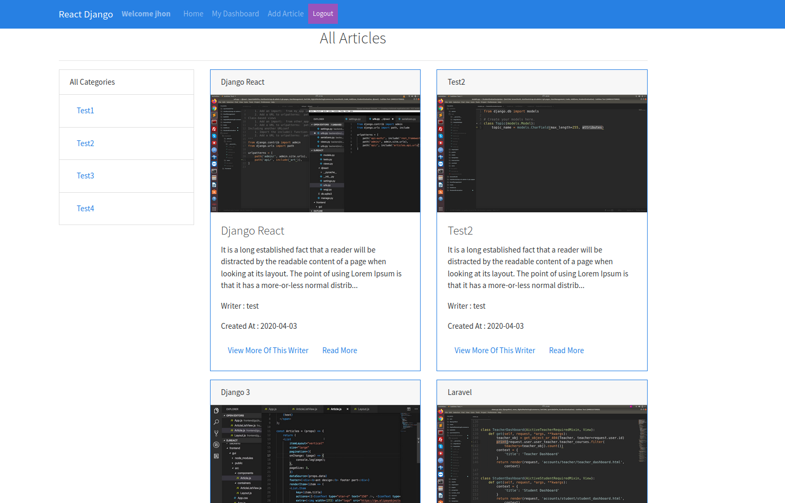

>#### Full stack Django/React/Redux app that uses token based authentication with Knox.
#

#

#### Quick Start
    # Install front-end dependencies
    npm install

    # Install backend-end dependencies and active virtual env
    pipenv shell
    pipenv install

    # Database Migration (from root)
    python blog/manage.py migrate

    # Super user Create
    python blog/manage.py createsuperuser

    # Serve API on localhost:8000 (from root)
    python blog/manage.py runserver

    # Run webpack (from root)
    npm run dev

    # Build for production
    npm run build
